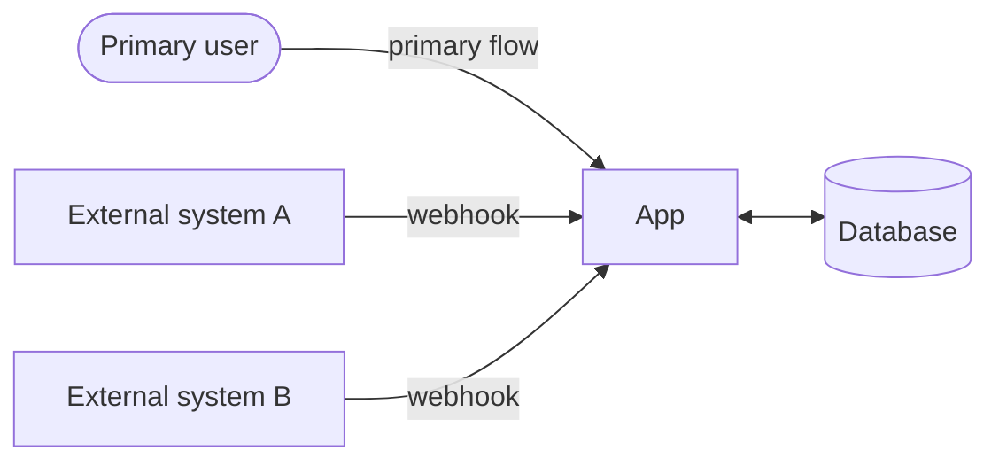
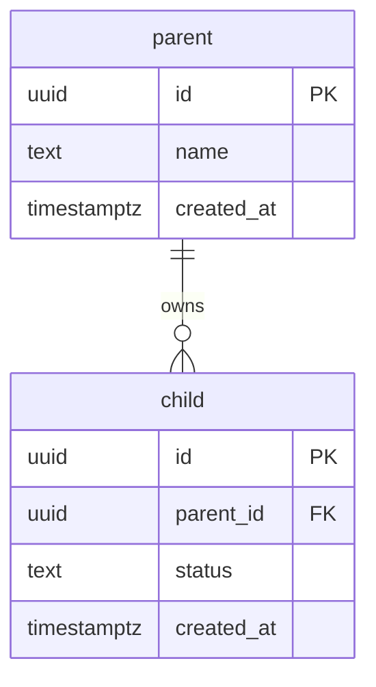
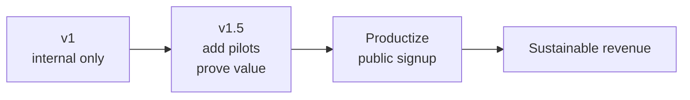

# {{Project Name}} — Project Overview

> The readable, diagram-augmented version of [`docs/specs/project-spec.md`](../specs/project-spec.md). The spec is the source of truth; this doc is for fast onboarding and AI context.
>
> **"v1"** = initial scope. **"v2"** = next-phase additions.

---

## ▸ At a glance

**[Product in one sentence — the value proposition the user feels.]**

| | |
|---|---|
| **Built for** | [primary customer / persona] |
| **Phase 1 (v1)** | [what ships first — minimum useful version] |
| **Path to scale** | [how this stays cheap to extend — multi-tenant from day one? plugin model? etc.] |
| **Productize trigger** | [the condition that flips this from internal/pilot to publicly sold] |

> [One pithy invariant about the data flow above — e.g., "If the app goes down, leads still land in the primary system and aren't lost."]

---

## 🎯 The problem we're solving

**[Name the problem in two words.]** [One sentence on why it matters.]

| System | What it owns |
|---|---|
| [Tool A] | [data class A] |
| [Tool B] | [data class B] |
| ... | ... |

> **[The sentence the customer would say out loud to describe the pain.]**

### What v1 removes

**[The smallest visible improvement.]** [One sentence on how it works.]

---

## 👥 Who uses it

| Role | v1 build | Deferred to v2+ |
|---|---|---|
| **[Role 1]** | ✅ Active. [What they do.] | — |
| **[Role 2]** | [Schema-supported? UI? not yet?] | [When they get full access] |
| **[Role 3]** | [...] | [...] |

---

## 🧩 What we're building

### v1 surfaces

| Surface | Description |
|---|---|
| 📥 **[Surface 1]** | [What it is, default behavior, key interaction.] |
| 👤 **[Surface 2]** | [What it is.] |
| 💬 **[Surface 3]** | [What it is.] |
| ⚙️ **Settings** | [What's editable.] |
| 🔐 **Auth** | [Auth provider, login UX, who can log in.] |

### Explicitly out of v1 (schema reserved, no UI)

- [Thing 1]
- [Thing 2]
- [...]

### v2+ (designed for, not built)

| Capability | Trigger to build |
|---|---|
| [Cap 1] | [What event signals it's time] |
| [Cap 2] | [...] |

---

## 🏗️ Tech stack

| Layer | Choice |
|---|---|
| Framework | **Next.js 16 (App Router)** with React Server Components |
| Styling | **Tailwind 4 + shadcn/ui** |
| Primitives | **Radix UI** |
| Icons | **Lucide** |
| Fonts | **[Body font] + [Mono font]** |
| Hosting | **Vercel** |
| Database | **Postgres via Neon** (Vercel Marketplace) |
| ORM | **Drizzle** with the Neon serverless (WebSocket) driver |
| Auth | **Better Auth** |
| AI | **Vercel AI Gateway → [model]** |
| Webhooks | **Route Handlers** (`app/api/inbound/.../route.ts`) |
| Mutations | **Server Actions** wrapped by transactional helpers |
| Realtime | **Polling (5s default)** for v1. `LISTEN/NOTIFY` or push in v2 if needed. |
| Caching | **Next.js 16 Cache Components** (`'use cache'` + `cacheTag` + `cacheLife`) |
| Observability | **Vercel Observability** + structured JSON logs |

---

## 🤖 Agent capabilities

MCPs installed in this project so AI agents can do meaningful work without copy-paste:

| MCP | Purpose | Install |
|---|---|---|
| `<mcp-name>` | <what it unlocks for the agent> | `<install command from MCP docs>` |

> Populated by `/workflow-init` based on stack picks. Common picks:
> - `neon` or `postgres` MCP for DB introspection
> - `context7` for up-to-date library docs
> - `playwright` for browser-driven testing
> - `vercel` / `cloudflare` MCPs for deploy ops
> - `stripe` MCP for payment testing
>
> Each user installs locally on their machine — these aren't auto-installed by cloning the repo.

---

## 🌐 [Routing / multi-tenancy model]

> Delete this section if your project is single-tenant. Otherwise: how do hosts / subdomains / paths map to data scopes? Who logs in where? What's locked vs. switchable?

---

## 🗄️ Data layer

**[DB choice] + [ORM choice].** Source of truth.

[2–3 sentences on the migration discipline, how schemas are isolated if multi-tenant, what gets denormalized for query patterns.]

See [`content-types.md`](../specs/content-types.md) for the entity catalog and [`data-layer.md`](../specs/data-layer.md) for the full schema + query helpers.

### Entity overview

### Day-one invariants (baked into migration #1)

| Win | Why |
|---|---|
| 🔒 [Invariant 1] | [Why it's worth enforcing at the DB layer day one] |
| 🔑 [Invariant 2] | [...] |

---

## 🖼️ Interface principles

**[App archetype — operational console / consumer surface / dashboard / etc.]** Inspiration: [refs].

### Anti-sprawl principles

1. **[Max nav items in v1.]**
2. **[Selection is client state vs. URL state.]**
3. **[Density vs. whitespace stance.]**
4. **[Keyboard-first or pointer-first.]**

---

## 💰 Path to revenue

[2–3 sentences on the revenue plan and when each stage triggers.]

---

## 📚 Documentation map

### Spec / planning docs (`docs/specs/`)

| File | Purpose |
|---|---|
| [`project-spec.md`](../specs/project-spec.md) | Master reference — source of truth |
| [`architecture-principles.md`](../specs/architecture-principles.md) | Idiomatic rules we commit to |
| [`data-layer.md`](../specs/data-layer.md) | DB schema, queries, invariants |

### AI / context docs (`docs/context/`)

| File | Purpose | Loaded |
|---|---|---|
| `thesis.md` | Strategy memo | every session |
| `project-overview.md` | This doc | every session |
| `coding-standards.md` | Coding style and rules | every session |
| `ai-interaction.md` | How AI interacts in this project | every session |
| `current-feature.md` | The feature being worked on right now | every session |
| [`backlog.md`](./backlog.md) | Deferred items from shipped features | on demand |

---

## ✅ Definition of done for v1

- [ ] [Concrete behavior 1 — observable end-to-end.]
- [ ] [Concrete behavior 2.]
- [ ] [Concrete behavior 3.]
- [ ] **Perf.** [Specific latency / throughput target.]

---

## 🛡️ Architecture invariants & known gaps

### Enforced day one

| Invariant | How |
|---|---|
| [Invariant] | [Enforcement mechanism] |

### Known gaps (deferred, not silent)

| Gap | Plan |
|---|---|
| [Gap] | [When/how it gets resolved] |

---

## 🔒 Decisions log

| Decision | Choice |
|---|---|
| **Framework** | [Next 16 / SvelteKit / etc.] |
| **Database** | [Neon / Supabase / etc.] |
| **Auth** | [Better Auth / Clerk / etc.] |
| **Mutation atomicity** | [Server actions + audit in single tx] |
| **Caching** | [Cache Components + tag invalidation] |
