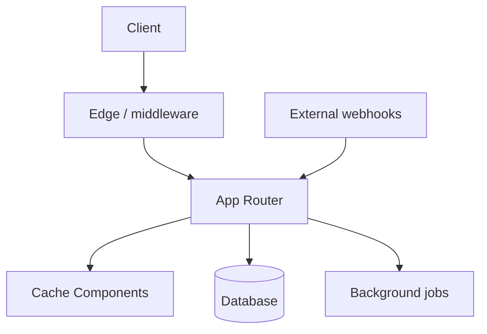

# {{Project Name}} — Project Spec

> **Source of truth.** Deeper detail than [`project-overview.md`](../context/project-overview.md) — schema, RLS policies, exact env keys, webhook contracts, migration discipline.
>
> **Not auto-imported.** Read on demand when an implementation question needs to ground in the authoritative version.
>
> **Sibling specs** (create when needed): `architecture-principles.md`, `content-types.md`, `data-layer.md`, `auth.md`, `integrations.md`, etc.

---

## 0 · How this spec relates to the overview

| Doc | Job |
|---|---|
| [`thesis.md`](../context/thesis.md) | Strategic memo — *why* we're building this |
| [`project-overview.md`](../context/project-overview.md) | Polished summary — *what* we're building, scannable |
| **`project-spec.md`** (this file) | Deeper detail — *how exactly*, contracts and invariants |

If overview and spec contradict, **spec wins** and overview gets updated to match.

---

## 1 · Architecture

### High-level diagram



### Layer responsibilities

| Layer | Owns | Doesn't own |
|---|---|---|
| Middleware | Host → workspace mapping, auth gate | Data fetching, mutations |
| Server Components | Page composition, data fetching | Client state, interactivity |
| Server Actions | Mutations, audit writes | Reads (those go through RSC) |
| Route Handlers | Webhooks, file uploads, third-party callbacks | Anything a Server Action can do |

---

## 2 · Data layer

### Schema decisions

[Document the key data modeling decisions — tenant model, polymorphic vs separate tables, denormalization, indexing strategy.]

### Multi-tenant enforcement

[If multi-tenant: describe the three layers — query helpers, transaction wrapper, RLS policies. Show example helper.]

```ts
// lib/db/with-workspace.ts
export async function withWorkspace<T>(
  ctx: WorkspaceCtx,
  fn: (tx: Tx) => Promise<T>,
): Promise<T> {
  return db.transaction(async (tx) => {
    await tx.execute(sql`SET LOCAL app.workspace_id = ${ctx.workspaceId}`);
    return fn(tx);
  });
}
```

### Mutation atomicity

Every mutation must:
1. Run inside a transaction
2. Write the change AND a corresponding `audit_log` row in the same tx
3. Call `revalidateTag(...)` for affected cache tags before returning

### Migration discipline

- Use `drizzle-kit generate` followed by `drizzle-kit migrate` (not `push`)
- Run `drizzle-kit check` before committing
- Production deploys run migrations before app starts

---

## 3 · Auth

[Provider, session model, cookie shapes, middleware enforcement. If using Better Auth, document the table renames (org → workspaces, member → memberships, etc.) and any custom schema extensions.]

---

## 4 · Webhooks & integrations

### Contract

- `2xx` = accepted or deduped (idempotent)
- `4xx` = malformed payload (won't retry)
- `5xx` = infrastructure error (publisher retries)
- Idempotency key required on every payload
- HMAC signature verification per route, per-workspace secret

### Routes

| Route | Source | Purpose |
|---|---|---|
| `app/api/inbound/{source}/route.ts` | [External system] | [What it ingests] |

---

## 5 · Caching

[Next.js 16 Cache Components — `'use cache'` + `cacheTag` + `cacheLife`. Document tag taxonomy.]

| Tag pattern | Invalidated by |
|---|---|
| `{entity}:{id}` | Single-entity mutations |
| `{entity}:{tenantId}` | List-wide changes |

---

## 6 · Definition of done

[The shippable checklist — moved from overview when it gets too detailed.]

---

## 7 · Decisions log (with reasoning)

| Decision | Choice | Reason |
|---|---|---|
| [Decision] | [Choice] | [Why this, not the alternatives] |

---

## 8 · Known gaps

| Gap | Plan |
|---|---|
| [Gap] | [How/when it gets resolved] |
